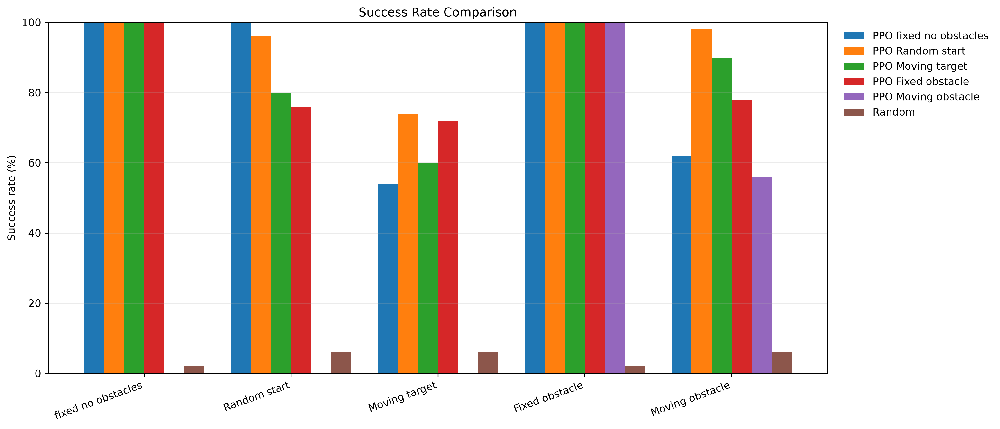
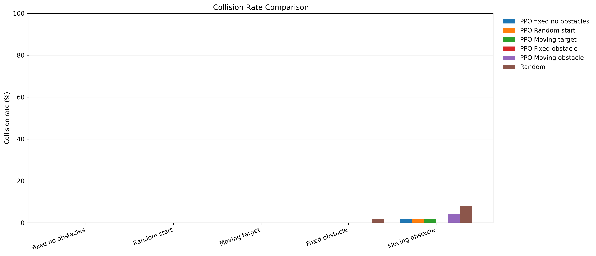
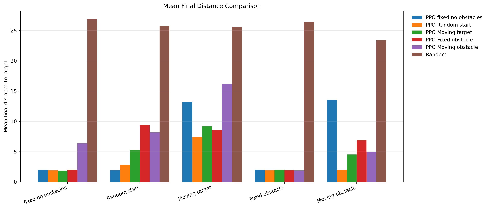
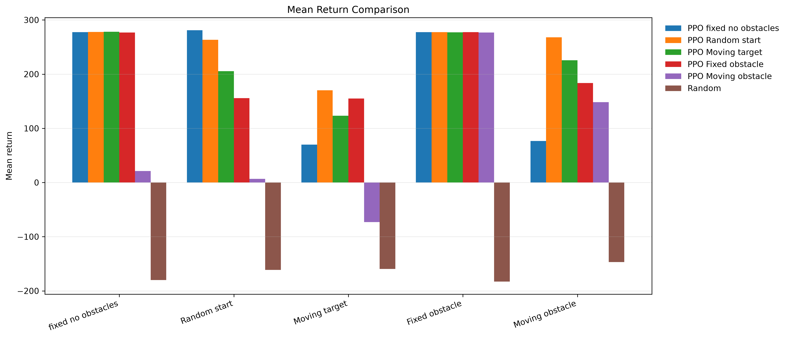
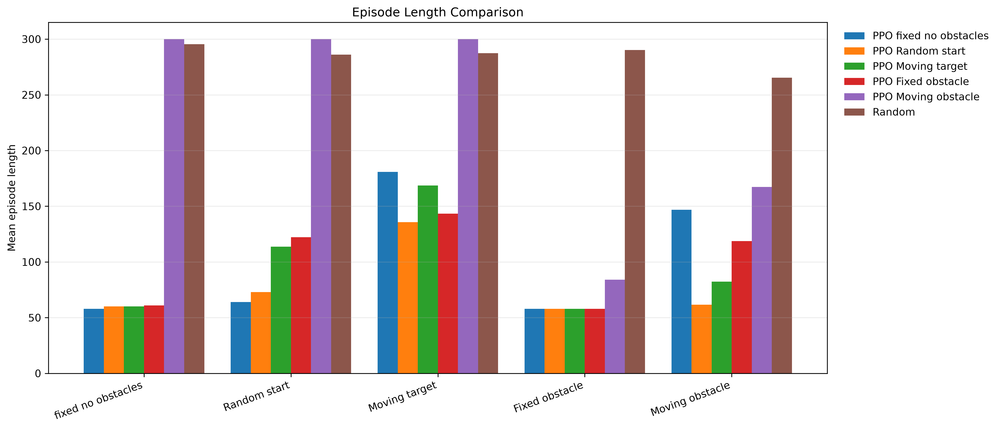
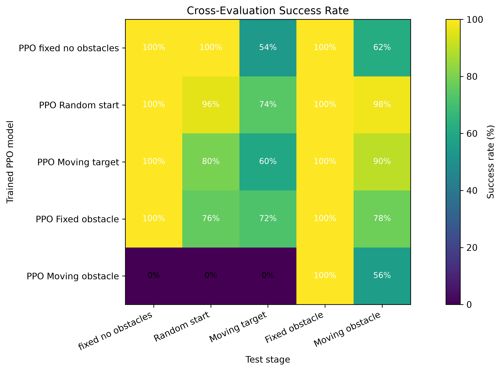
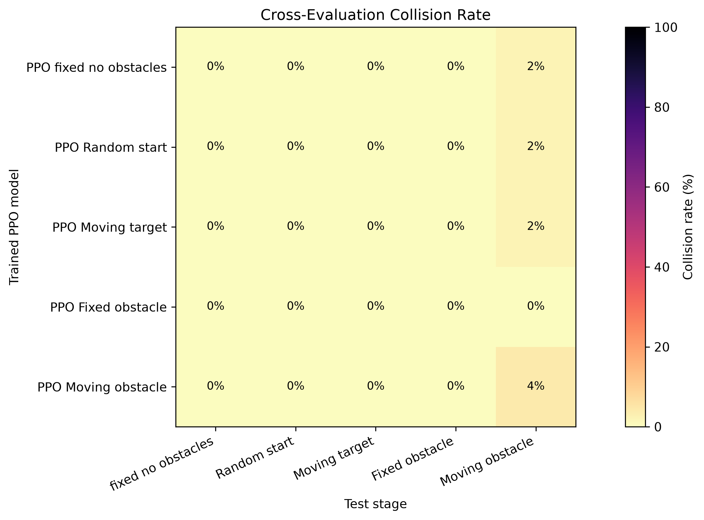

# DeepBlue AUV RL

DeepBlue AUV RL trains an autonomous underwater vehicle (AUV) in
[HoloOcean](https://byu-holoocean.github.io/holoocean-docs/) with a custom
Gymnasium environment and PPO from Stable-Baselines3. The main task is simple:
move the AUV to a target while staying inside the mission bounds and avoiding
obstacles when they are enabled.

The project package is `deepblue_auv_rl`. The main environment is
`AUVTargetEnv` in `src/deepblue_auv_rl/envs/auv_target_env.py`.

## Problem Definition

The AUV runs in the HoloOcean `Ocean` package, using the `PierHarbor` world and
the `HoveringAUV` agent. Each episode starts with a target position and,
depending on the stage, may include a random start, a moving target, a fixed
obstacle, or a moving obstacle.

The policy should:

- reach the target position,
- avoid collisions with obstacles,
- stay inside the configured 3D bounds,
- finish the episode before the maximum step limit.

## RL Formulation

| Part | Current implementation |
| --- | --- |
| Observation | 10 continuous values: target delta `(dx, dy, dz)`, distance to target, closest obstacle delta `(dx, dy, dz)`, closest obstacle distance, `sin(yaw)`, and `cos(yaw)`. |
| Action | 6 discrete actions: `forward`, `turn_left`, `turn_right`, `move_up`, `move_down`, `stop_collect`. |
| Reward idea | Reward progress toward the target, apply a small step penalty, add a goal reward, and penalize out-of-bounds, collisions, and unsafe obstacle proximity. |
| Episode end | Terminates on target success, collision, or out-of-bounds. Truncates when `MissionConfig.max_steps` is reached. |

Training and evaluation use these stages:

| Stage | Meaning |
| --- | --- |
| `fixed_no_obstacles` | Fixed start, fixed target, no obstacles. |
| `random_start_no_obstacles` | Randomized start, fixed target, no obstacles. |
| `moving_no_obstacles` | Randomized start, moving target, no obstacles. |
| `fixed_obstacles` | Fixed start and target with one fixed obstacle. |
| `moving_obstacles` | Randomized start and one moving obstacle. |

## Technologies Used

- Python
- HoloOcean
- Gymnasium
- Stable-Baselines3 PPO
- NumPy
- Matplotlib
- Pandas
- TensorBoard

## Repository Structure

```text
.
├── models/                         # Trained PPO checkpoints and training summaries
├── outputs/
│   ├── eval/                       # Evaluation JSON, CSV, and summary files
│   ├── plots/                      # Comparison plots and cross-evaluation heatmaps
│   ├── rollouts/                   # Saved rollout CSVs and trajectory plots
│   └── videos/                     # GIF demos
├── scripts/
│   ├── train_ppo.py                # PPO training entry point
│   ├── evaluate_model.py           # Evaluate one trained PPO model
│   ├── sample_model.py             # Run a visible HoloOcean rollout
│   ├── save_rollout_trajectory.py  # Save rollout CSVs and trajectory plots
│   ├── create_cross_eval_summary.py
│   ├── plot_evaluation_results.py
│   ├── evaluate_random_policy.py
│   └── install_ocean_package.py
├── src/deepblue_auv_rl/
│   ├── envs/auv_target_env.py      # AUVTargetEnv and MissionConfig
│   └── evaluation/evaluate.py      # Shared evaluation helpers
├── pyproject.toml
└── requirements.txt
```

Existing trained checkpoints found in this checkout:

- `models/ppo_curriculum_new_fixed_no_obstacles_50000_steps_seed_42.zip`
- `models/ppo_curriculum_v3_random_start_no_obstacles_100000_steps_seed_42.zip`
- `models/ppo_curriculum_new_moving_no_obstacles_100000_steps_seed_42.zip`
- `models/ppo_curriculum_new_fixed_obstacles_150000_steps_seed_42.zip`
- `models/ppo_curriculum_new_moving_obstacles_150000_steps_seed_42.zip`

## Installation

HoloOcean can require platform-specific setup. Start with the official
installation guide:

https://byu-holoocean.github.io/holoocean-docs/develop/usage/installation.html

Create and activate a virtual environment:

```bash
python -m venv .venv
```

On Linux/macOS:

```bash
source .venv/bin/activate
```

On Windows PowerShell:

```powershell
.\.venv\Scripts\Activate.ps1
```

Install the Python dependencies and the local package:

```bash
python -m pip install --upgrade pip
pip install -r requirements.txt
pip install -e .
```

This repository uses the HoloOcean `Ocean` package in the environment scenario.
Install it after HoloOcean is available:

```bash
python -c "import holoocean; holoocean.install('Ocean')"
```

Or use the helper script:

```bash
python scripts/install_ocean_package.py
```

## How to Train

The PPO training script is `scripts/train_ppo.py`. It accepts:

- `--total-timesteps`
- `--seed`
- `--model-name`
- `--device` with `auto`, `cpu`, or `cuda`
- `--stage`
- `--load-model`

Example curriculum-style commands:

```bash
python scripts/train_ppo.py --total-timesteps 100000 --stage fixed_no_obstacles --model-name ppo_curriculum --seed 42
python scripts/train_ppo.py --total-timesteps 100000 --stage random_start_no_obstacles --model-name ppo_curriculum --seed 42
python scripts/train_ppo.py --total-timesteps 150000 --stage fixed_obstacles --model-name ppo_curriculum --seed 42
```

Examples matching checkpoints already present in this checkout:

```bash
python scripts/train_ppo.py --total-timesteps 50000 --stage fixed_no_obstacles --model-name ppo_curriculum_new --seed 42
python scripts/train_ppo.py --total-timesteps 100000 --stage moving_no_obstacles --model-name ppo_curriculum_new --seed 42
python scripts/train_ppo.py --total-timesteps 150000 --stage moving_obstacles --model-name ppo_curriculum_new --seed 42
```

Continue training from an existing model:

```bash
python scripts/train_ppo.py --total-timesteps 150000 --stage fixed_obstacles --model-name ppo_curriculum_new --seed 42 --load-model models/ppo_curriculum_new_moving_no_obstacles_100000_steps_seed_42.zip
```

Training saves:

- model checkpoints in `models/`,
- training summaries in `models/*_training_summary.json`,
- monitor logs in `logs/`,
- TensorBoard logs in `logs/tensorboard/`.

Current checkout note: `scripts/train_ppo.py` references `args.max_steps`
inside `main()`, but the parser does not currently define a `--max-steps`
argument. If training exits with an `AttributeError`, restore that parser option
or set `max_steps` from `MissionConfig` before running long training jobs.

## How to Evaluate

Use `scripts/evaluate_model.py` to evaluate one trained PPO checkpoint.

```bash
python scripts/evaluate_model.py --model models/ppo_curriculum_new_fixed_obstacles_150000_steps_seed_42.zip --stage fixed_obstacles --episodes 50 --seed 1000 --deterministic --output outputs/eval/own_stage/
```

The script resolves bare model names inside `models/`, so this also works:

```bash
python scripts/evaluate_model.py --model ppo_curriculum_new_moving_obstacles_150000_steps_seed_42 --stage moving_obstacles --episodes 50 --seed 1000 --deterministic --output outputs/eval/own_stage/
```

Evaluation saves three files for each run:

- a combined results JSON with metadata, summary metrics, and episode rows,
- a per-episode CSV,
- a summary JSON.

The default output folder is `outputs/eval/`.

## How to Sample or Watch a Trained Model

Use `scripts/sample_model.py` to run a trained PPO policy in a visible HoloOcean
viewport. The script creates the environment with `show_viewport=True` and logs
the rollout to `outputs/visual_rollouts/`.

```bash
python scripts/sample_model.py --model models/ppo_curriculum_v3_random_start_no_obstacles_100000_steps_seed_42.zip --stage random_start_no_obstacles --episodes 1 --seed 1000 --deterministic --sleep 0.05
```

Useful options:

- `--sleep 0.05` slows the rollout so it is easier to watch.
- `--no-markers` disables demo target and obstacle markers.
- `--deterministic` can be passed as a flag or as `true`/`false`.

On remote desktops, make sure the display is available before running the
visual sampler.

## How to Generate and View Plots

Create a combined cross-evaluation CSV from summary JSON files:

```bash
python scripts/create_cross_eval_summary.py --input-dir outputs/eval/cross_eval --output outputs/eval/cross_eval_summary.csv
```

Generate comparison plots and heatmaps:

```bash
python scripts/plot_evaluation_results.py --cross-summary outputs/eval/cross_eval_summary.csv --output outputs/plots --formats png pdf
```

Generate rollout trajectory CSVs and top-down plots:

```bash
python scripts/save_rollout_trajectory.py --model models/ppo_curriculum_new_moving_obstacles_150000_steps_seed_42.zip --stage moving_obstacles --episodes 3 --seed 5000 --deterministic --output-dir outputs/rollouts/final_moving_obstacles
```

The generated images can be opened directly from `outputs/plots/` and
`outputs/rollouts/`.

## Results

Existing result artifacts are stored under `outputs/`. The plots below are
included only because the files exist in this checkout.

### Evaluation Comparison Plots



_Success-rate comparison across evaluation stages and policies._



_Collision-rate comparison across evaluation stages and policies._



_Mean final distance to the target after each evaluation episode._



_Mean episode return for PPO and baseline policies._



_Mean episode length across stages and policies._

### Cross-Evaluation Heatmaps



_Success rate when each trained PPO checkpoint is tested on each stage._



_Collision rate when each trained PPO checkpoint is tested on each stage._

## Videos and GIFs

Existing GIF demos found in `outputs/videos/`:

_Fixed start and target with no obstacles._


_Random-start target-reaching demo with no obstacles._


_Moving-target demo without obstacles._


_Fixed-obstacle demo._


_Moving-obstacle demo ending in success._


_Moving-obstacle demo ending in failure._


## Reproducibility

Use the same stage name, model path, seed, and deterministic setting when
comparing runs. Training uses `--seed`; evaluation uses the base `--seed` and
runs episode `i` with `seed + i`.

Reference evaluation command:

```bash
python scripts/evaluate_model.py --model models/ppo_curriculum_new_fixed_obstacles_150000_steps_seed_42.zip --stage fixed_obstacles --episodes 50 --seed 1000 --deterministic --output outputs/eval/own_stage/
```

Important paths:

- checkpoints: `models/*.zip`
- training summaries: `models/*_training_summary.json`
- evaluation outputs: `outputs/eval/`
- plots: `outputs/plots/`
- rollout trajectory plots: `outputs/rollouts/`
- GIF demos: `outputs/videos/`

Results may vary slightly depending on CPU/GPU behavior, HoloOcean version,
rendering setup, and simulator timing.

## References

- [HoloOcean documentation](https://byu-holoocean.github.io/holoocean-docs/)
- [HoloOcean installation guide](https://byu-holoocean.github.io/holoocean-docs/develop/usage/installation.html)
- [Stable-Baselines3 PPO documentation](https://stable-baselines3.readthedocs.io/en/master/modules/ppo.html)
- [Gymnasium documentation](https://gymnasium.farama.org/)
